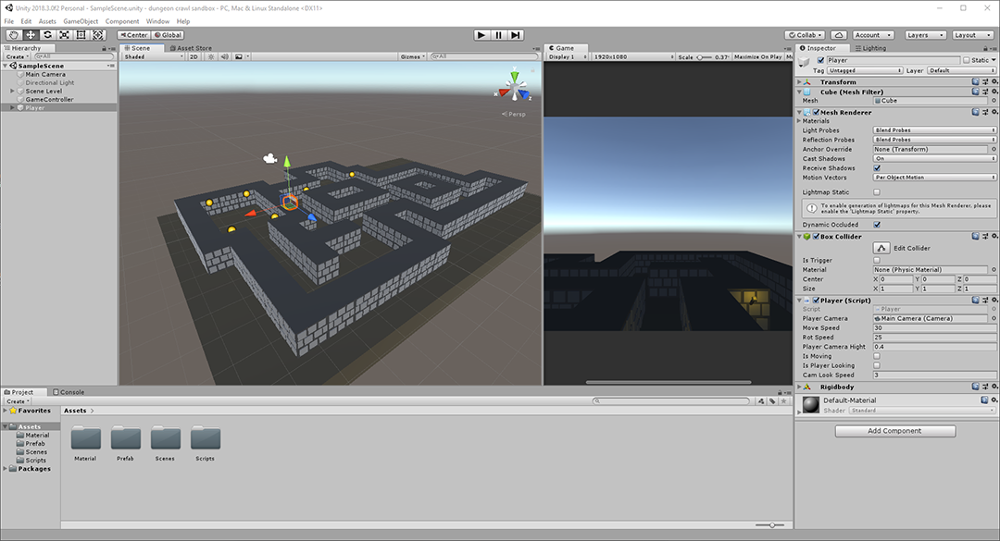

# dungeon-crawl-sandbox

playing around with making a turn-ish based first person dungeon crawler

a unity project to work out the basic movement  of a first person dungeon crawl game in the likeness of Dungeon Master or 
Legend of Grimrock.  

(W) move foward
(S) move backwards
(A) turn left
(D) turn right
(L) activate mouse look

